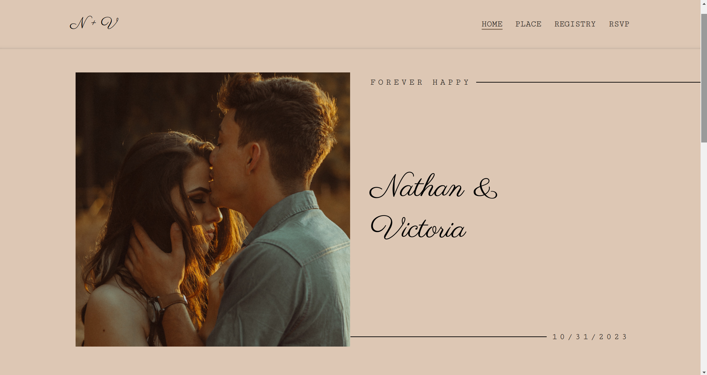

# Wedding Page Mockup

## A Personal Web Development Project

This project is a wedding page mockup, designed as a personal learning exercise in web development. It features pages for RSVP, place details, and registry information, created using vanilla HTML, SCSS, and JavaScript. The design is fully responsive, ensuring a seamless experience on both desktop and mobile devices.

### Features

- **Responsive Design:** Works smoothly on mobile and desktop.
- **Image Carousel:** Implemented with the Splide.js library for an interactive photo display.
- **Google Maps Integration:** Users can create a route from their location to the wedding venue using the Google Maps API.

### User Instructions

You can view the live project [here](https://felipepulcherio.github.io/wedding-mockup/)

To replicate the project locally:

1. Clone the repository to your local machine.
2. Run a local development server, or open `index.html` directly in your browser.
3. SCSS files are located in the `styles/` folder. Compile them to apply changes to the CSS.
4. JavaScript functions are in `scripts/mainscript.js`.
